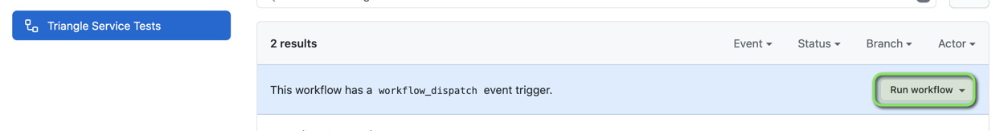

# Triangle Service Test Framework

Simple test framework which I developed for testing of Triangle Service deployed on https://qa-quiz.natera.com/

## Run tests from GitHub
To be able to Run pipeline you have to request access. Without it you may look previous runs.
1. Run pipeline - https://github.com/slavashmel/triangle-service/actions?query=workflow%3A%22Triangle+Service+Tests%22

2. Look Allure Report - https://slavashmel.github.io/triangle-service/

## Run from local machine
You should have installed git, mvn, JDK 11
1. git clone https://github.com/slavashmel/triangle-service.git
2. cd triangle-service
3. mvn clean test

## Helpful links
- You can find feature files in "src/test/java/features"
